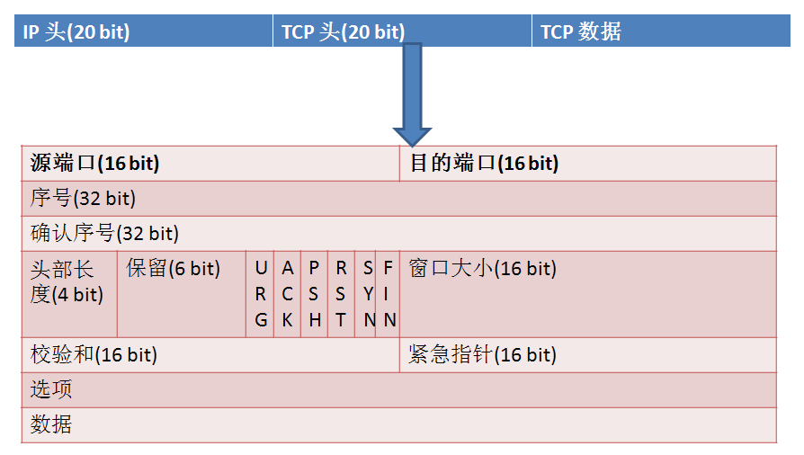

在TCP协议中RST表示复位，用来关闭异常的连接，在TCP的设计中它是不可或缺的。

发送RST包关闭连接时，不必等缓冲区的包都发出去，直接就丢弃缓存区的包发送RST包。而接收端收到RST包后，也不必发送ACK包来确认。

# 产生 RST 原因：

- 端口未打开

  服务器程序端口未打开而客户端来连接，例如telnet一个未打开的TCP的端口可能会出现这种错误。

- 提前关闭

  比如主机A和主机B正常建立连接后，A向B发送了FIN包要求关连接，B发送ACK后，网断了，A通过若干原因放弃了这个连接（例如进程重启）。网通了后，B又开始发数据包，A收到后表示压力很大，不知道这野连接哪来的，就发了个RST包强制把连接关了，B收到后会出现connect reset by peer错误。

- 存在端口号但进程服务未打开

  客户端连接服务器时，如果服务器在指定的端口上并没有进程在等待连接（服务器进程并没有开启），那么服务器将发送RST响应给客户端

- 请求超时

  客户端在发送SYN请求建立连接的时候，在设置socket的时候设置了等待服务器响应的时间，如果超出了这个时间服务器才发过来SYN+ACK，那么这个时候客户端会认为这个连接已经超时，响应一个RST给服务器，而不是ACK

- 服务器主机崩溃后重启

  服务器重启后，所有的TCP连接丢失，这个时候客户端再发送来数据，服务器会认为不认识这个连接，响应一个RST，这个时候服务器端就可能响应大量的RST

# RST攻击

服务器A和服务器B之间建立了TCP连接，此时服务器C伪造了一个TCP包发给B，使B异常的断开了与A之间的TCP连接，这就是RST攻击。

## 如何产生

- 假定C伪装成A发过去的包，这个包如果是RST包的话，毫无疑问，B将会丢弃与A的缓冲区上所有数据，强制关掉连接；
- 如果发过去的包是SYN包，B会表示A已经发疯了（与OS的实现有关），正常连接时又来建新连接，B主动向A发个RST包，并在自己这端强制关掉连接；

## 如何生成

一个TCP连接都是四元组，由**源IP+源端口、目标IP+目标端口**唯一确定一个连接。

这里B作为服务器，IP和端口是公开的，A是我们要下手的目标，IP当然知道，但A的源端口就不清楚了，因为这可能是A**随机生成**的。当然，如果能够对常见的OS如windows和linux找出生成source port规律的话，还是可以搞定的。

伪造的TCP包里需要填序列号（SeqNum），如果序列号的值不在A之前向B发送时B的滑动窗口内，B是会主动丢弃的。所以我们要找到能落到当时的AB间滑动窗口的序列号。这个可以暴力解决，因为一个sequence长度是32位，取值范围0-4294967296，如果滑动窗口大小为65535的话，则最多只需要发65537（4294967296/65535=65537）个包就能有一个序列号落到滑动窗口内。