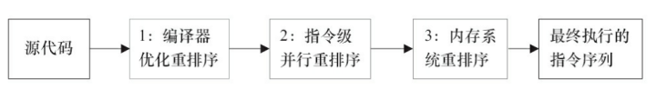

# 并发编程三个概念

- 原子性

  一个操作或者多个操作要么都执行，要么都不执行

- 可见性

  多个线程访问同一变量时，一个线程修改了变量的值，其他线程能够立即看到修改的值

- 有序性

  程序执行的顺序按照代码的先后顺序执行

# 内存模型JMM

JMM java内存模型只是一种抽象概念，描述一组规则或规范，通过这组规范定义程序各个变量的访问方式。

JVM运行程序的实体是线程，而每个线程创建时 JVM 都会为其创建一个工作内存（栈内存），用于存储线程私有的数据。

而Java 内存模型中规定**所有变量都存储在主内存**，其主内存是共享内存区域，所有线程都可以访问，但线程对变量的操作（读取赋值等）必须在工作内存中进行。所以首先要将变量从主内存拷贝到增加的工作内存空间，然后对变量进行操作，操作完成后再将变量写回主内存，不能直接操作主内存中的变量。

因此不同的线程间无法访问对方的工作内存，线程间的通信（传值）必须通过主内存来完成。

**JMM如何解决原子性、可见性、有序性问题：**

## 原子性

JMM中只保证了**基本读取**和**赋值**是原子操作，如**i++**等都不是原子操作。实现原子操作需要使用锁 synchronized 或者 Lock。

## 可见性

JMM使用**volatile**保证可见性。

当共享变量被volatile修饰时，保证修改的值会立即更新到**主存**上，并且其它线程读取时，会去内存上读取新值。

synchronized 和 Lock 也可以保证可见性，因为它们可以保证任一时刻只有一个线程能访问共享资源，并在其释放锁之前将修改的变量刷新到内存中。

## 有序性

JMM中，允许**编译器和处理器**进行**指令重排**，会影响到多线程的执行。JMM中，可以通过volatile关键字保证有序性.

另外可以通过 synchronized 和 Lock 来保证有序性

### 指令重排

Java语言规范规定 JVM 线程内部维持顺序化语义。即只要程序的最终结果与它顺序化情况的结果相等，那么指令的执行顺序可以与代码顺序不一致，此过程叫做指令的重排序。

指令重排序的意义是什么？JVM能根据处理特性（CPU多级缓存、多核处理器等）适当的对机器指令进行重排序，使机器指令更更符合CPU的执行特性，最大限度的发挥机器性能。

# 总结

## volatile作用

- 保证不同线程对变量操作的**可见性**，

  即一个线程修改了变量的值，volatile能够保证新值立即同步到主存上,而且每次使用时立即从主内存上刷新.

- 禁止进行指令重排，能够保证有序性

- volatile 无法保证原子性

