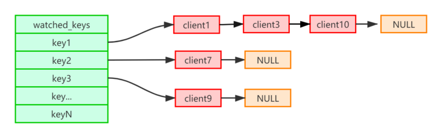
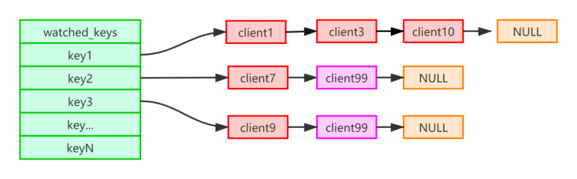

# redis事务

## 使用命令

`multi` `exec` `discard` `watch`

## 流程

使用 `multi` 命令，即**开启事务**后，可以输入多个命令，redis不会执行这些命令，而是将他们放到队列中去。当调用了 `exec` 命令，即**执行事务**后，才会执行。

可以使用 `discard` 命令取消一个事务，他会清空事务队列中保存的所有事务。

`WATCH` 命令用于在事务开始之前监视任意数量的键： 当调用 EXEC 命令执行事务时， 如果任意一个被监视的键已经被其他客户端修改了， 那么整个事务将被打断，不再执行， 直接返回失败。

WATCH命令可以被调用多次。 对键的监视从 WATCH 执行之后开始生效， 直到调用 EXEC 为止。

## 特点

Redis 事务可以一次执行多个命令，本质是一组命令的集合。一个事务中的所有命令都会序列化，按顺序地串行化执行而不会被其它命令插入，不许加塞。

可以保证一个队列中，一次性、顺序性、排他性的执行一系列命令（Redis 事务的主要作用其实就是串联多个命令防止别的命令插队）

## redis不支持rollback

由于redis不支持rollback，所以redis不满足原子性。

# watch原理

Redis 中有一个数据结构 **watched_keys** 字典，**字典的键是这个数据库被监视的键**， 而字典的值是一个链表， **链表中保存了所有监视这个键的客户端**。

**`WATCH` 命令的作用， 就是将当前客户端和要监视的键在 `watched_keys` 中进行关联。**

>  如果当前客户端为 `client99` ， 那么当客户端执行 `WATCH key2 key3` 时， 前面展示的 `watched_keys` 将被修改成这个样子：
>
> 

通过 `watched_keys` 字典， 如果程序想检查某个键是否被监视， 那么它只要检查字典中是否存在这个键即可； 如果程序要获取监视某个键的所有客户端， 那么只要取出键的值（一个链表）， 然后对链表进行遍历即可。

当修改 **watched_keys** 中键值时，会将监视这个 key 值的客户端的**REDIS_DIRTY_CAS** 打开。

当客户端执行 exec 命令时，会对客户端状态进行检查：

- 如果事务的 **CLIENT_DIRTY_CAS** 选项被打开，说明客户端监视的键至少有一个已经被修改了，事务的安全性已经被破坏。客户端会放弃执行这个事务，直接向客户端返回空回复，表示事务执行失败。
- 如果 `CLIENT_DIRTY_CAS` 选项没有被打开，那么说明所有监视键都安全，服务器正式执行事务。
