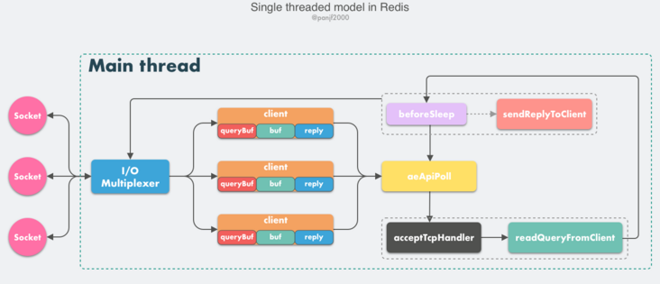

1. redis 4.0 引入多线程处理异步任务
2. redis 6.0 正式在网络模型中实现 I/O 多线程

# 单线程事件循环

从 Redis 的 v1.0 到 v6.0 版本之前，Redis 的核心网络模型一直是一个典型的**单 Reactor 模型**：利用 epoll/select/kqueue 等多路复用技术，在单线程的事件循环中不断去处理事件（客户端请求），最后回写响应数据到客户端：

> Reactor 模式本质上指的是使用 `I/O 多路复用(I/O multiplexing) + 非阻塞 I/O(non-blocking I/O)` 的模式。

## 组件

- **client**

  客户端对象，Redis 是典型的 CS 架构（Client <---> Server），客户端通过 **socket** 与服务端建立网络通道然后发送请求命令，服务端执行请求的命令并回复。

  > **Redis** 使用结构体 **client** 存储客户端的所有相关信息，包括但不限于`封装的套接字连接 -- *conn`，`当前选择的数据库指针 -- *db`，`读入缓冲区 -- querybuf`，`写出缓冲区 -- buf`，`写出数据链表 -- reply`等。

- **aeApiPoll**

  I/O 多路复用 API，是基于 epoll_wait/select/kevent 等系统调用的封装，监听等待读写事件触发，然后处理，它是事件循环（Event Loop）中的核心函数，是事件驱动得以运行的基础。

- **acceptTcpHandler**

  连接应答处理器，底层使用系统调用 `accept` 接受来自客户端的新连接，并为新连接注册绑定命令读取处理器，以备后续处理新的客户端 TCP 连接;除了这个处理器，还有对应的 `acceptUnixHandler` 负责处理 Unix Domain Socket 以及 `acceptTLSHandler` 负责处理 TLS 加密连接。

- **readQueryFromClient**

  命令读取处理器，解析并执行客户端的请求命令。

- **beforeSleep**

  事件循环中进入 aeApiPoll 等待事件到来之前会执行的函数，其中包含一些日常的任务，比如把 `client->buf` 或者 `client->reply` （后面会解释为什么这里需要两个缓冲区）中的响应写回到客户端，持久化 AOF 缓冲区的数据到磁盘等，相对应的还有一个 afterSleep 函数，在 aeApiPoll 之后执行。

- **sendReplyToClient**

  命令回复处理器，当一次事件循环之后写出缓冲区中还有数据残留，则这个处理器会被注册绑定到相应的连接上，等连接触发写就绪事件时，它会将写出缓冲区剩余的数据回写到客户端。

## 具体流程

1. Redis 服务器启动，开启主线程事件循环（Event Loop），注册 `acceptTcpHandler` 连接应答处理器到用户配置的监听端口对应的文件描述符，等待新连接到来；
2. 客户端和服务端建立网络连接；
3. `acceptTcpHandler` 被调用，主线程使用 AE 的 API 将 `readQueryFromClient` 命令读取处理器绑定到新连接对应的文件描述符上，并初始化一个 `client` 绑定这个客户端连接；
4. 客户端发送请求命令，触发读就绪事件，主线程调用 `readQueryFromClient` 通过 socket 读取客户端发送过来的命令存入 `client->querybuf` 读入缓冲区；
5. 接着调用 `processInputBuffer`，在其中使用 `processInlineBuffer` 或者 `processMultibulkBuffer` 根据 Redis 协议解析命令，最后调用 `processCommand` 执行命令；
6. 根据请求命令的类型（SET, GET, DEL, EXEC 等），分配相应的命令执行器去执行，最后调用 `addReply` 函数族的一系列函数将响应数据写入到对应 `client` 的写出缓冲区：`client->buf` 或者 `client->reply` ，`client->buf` 是首选的写出缓冲区，固定大小 16KB，一般来说可以缓冲足够多的响应数据，但是如果客户端在时间窗口内需要响应的数据非常大，那么则会自动切换到 `client->reply` 链表上去，使用链表理论上能够保存无限大的数据（受限于机器的物理内存），最后把 `client` 添加进一个 LIFO 队列 `clients_pending_write`；
7. 在事件循环（Event Loop）中，主线程执行 `beforeSleep` --> `handleClientsWithPendingWrites`，遍历 `clients_pending_write` 队列，调用 `writeToClient` 把 `client` 的写出缓冲区里的数据回写到客户端，如果写出缓冲区还有数据遗留，则注册 `sendReplyToClient` 命令回复处理器到该连接的写就绪事件，等待客户端可写时在事件循环中再继续回写残余的响应数据。

# 多线程异步

Redis 在 v4.0 版本的时候就已经引入了的多线程来做一些异步操作，此举主要针对的是那些**非常耗时的命令**，通过将这些命令的执行进行异步化，避免阻塞单线程的事件循环。

# 多线程网络模型

 Redis 最初选择单线程网络模型的理由是：CPU 通常不会成为性能瓶颈，瓶颈往往是**内存**和**网络**，因此单线程足够了。那么为什么现在 Redis 又要引入多线程呢？很简单，就是 **Redis 的网络 I/O 瓶颈已经越来越明显了**。

https://segmentfault.com/a/1190000039223696