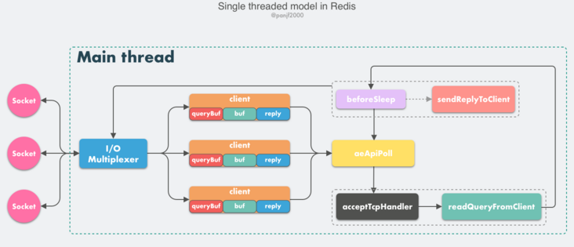

# 线程模型

Redis 基于 Reactor 模式开发了网络事件处理器，这个处理器叫做**文件事件处理器 File Event Handler**。

这个文件事件处理器是单线程的，采用 **IO 多路复用**机制监听多个 socket，根据 socket 上的事件来选择对应的事件处理器来处理这个事件。

## 组成

- 多个 socket。

  socket 会产生 **ae_readable** 和 **ae_writable** 事件

  - 当 socket 变得可读或者有新的 socket 出现时，socket 产生 ae_readable 事件
  - 当 socket 变得可写，socket 产生 ae_writable 事件

- IO 多路复用程序

- 文件时间分派器

- 事件处理器

  事件处理器包括：连接应答处理器、命令请求处理器、命令回复处理器，对应不同功能

  - 客户端连接 redis，会为 socket **关联** 连接应答处理器
  - 客户端发送读写请求命令，会为 socket 关联 命令请求处理器
  - 客户端要从 redis 取数据，会为 socket 关联 命令回复处理器

## 简要流程

多个 socket 产生不同的事件，不同的事件对应不同的操作，IO 多路复用程序监听这些 socket。

当这些socket产生了事件时，IO 多路复用程序就会将这些事件放到队列中，通过队列，以有序、同步、每次一个事件的方式向 文件事件分派器 中传送。**当事件处理器处理完一个事件后**，IO多路复用程序才会继续向 文件分派器 传送下一个事件。

## 详细流程

### 建立连接

1. redis 服务端初始化时，将 server socket 的 ae_readable 事件与 连接应答处理器 连接
2. 客户端 socket1 向 redis 进程的 server socket 请求建立连接时，server socket 会产生 ae_readable 事件，IO 多路复用程序监听后将该事件压入队列中。
3. 文件事件分派器从队列中获取 socket，交给 连接应答处理器
4. 连接应答处理器 会将 socket1 的 ae_readable 事件与 命令请求处理器 关联。

## 执行 set 请求

1. 客户端发送 set key value 请求，此时 redis 的 socket1 会产生 ae_readable 事件，IO 多路复用程序将该事件压入队列
2. 文件事件分派器从队列中获取该 ae_readable 事件，由于前面的 socket1 的 ae_readble 事件已经与 命令请求处理器 关联，所以会将该事件分派给其它的 命令请求处理器 处理，该 命令请求处理器 会读取 socket1 中的 key 和 value，并在自己的内存中完成 key value 的设置。
3. 命令请求处理器操作完成后，会将 socket1 的 ae_writable 事件与 命令回复处理器 **关联**
4. 如果客户端准备好接收数据了，那么 redis 中的 socke1 会产生一个 ae_writable 事件，压入队列。
5. 事件分派器 **找到相关联的命令回复处理器**，由命令回复处理器对 socket1 输入本次操作的结果。
6. 解除 socket1 的 ae_writable 事件与 命令回复处理器 的关联。

# 前提

1. redis 4.0 引入多线程处理异步任务
2. redis 6.0 正式在网络模型中实现 I/O 多线程

# 单线程事件循环

从 Redis 的 v1.0 到 v6.0 版本之前，Redis 的核心网络模型一直是一个典型的**单 Reactor 模型**：利用 epoll/select/kqueue 等多路复用技术，在单线程的事件循环中不断去处理事件（客户端请求），最后回写响应数据到客户端：

> Reactor 模式本质上指的是使用 `I/O 多路复用(I/O multiplexing) + 非阻塞 I/O(non-blocking I/O)` 的模式。

## 组件

- **client**

  客户端对象，Redis 是典型的 CS 架构（Client <---> Server），客户端通过 **socket** 与服务端建立网络通道然后发送请求命令，服务端执行请求的命令并回复。

  > **Redis** 使用结构体 **client** 存储客户端的所有相关信息，包括但不限于`封装的套接字连接 -- *conn`，`当前选择的数据库指针 -- *db`，`读入缓冲区 -- querybuf`，`写出缓冲区 -- buf`，`写出数据链表 -- reply`等。

- **aeApiPoll**

  I/O 多路复用 API，是基于 epoll_wait/select/kevent 等系统调用的封装，监听等待读写事件触发，然后处理，它是事件循环（Event Loop）中的核心函数，是事件驱动得以运行的基础。

- **acceptTcpHandler**

  连接应答处理器，底层使用系统调用 `accept` 接受来自客户端的新连接，并为新连接注册绑定命令读取处理器，以备后续处理新的客户端 TCP 连接;除了这个处理器，还有对应的 `acceptUnixHandler` 负责处理 Unix Domain Socket 以及 `acceptTLSHandler` 负责处理 TLS 加密连接。

- **readQueryFromClient**

  命令读取处理器，解析并执行客户端的请求命令。

- **beforeSleep**

  事件循环中进入 aeApiPoll 等待事件到来之前会执行的函数，其中包含一些日常的任务，比如把 `client->buf` 或者 `client->reply` （后面会解释为什么这里需要两个缓冲区）中的响应写回到客户端，持久化 AOF 缓冲区的数据到磁盘等，相对应的还有一个 afterSleep 函数，在 aeApiPoll 之后执行。

- **sendReplyToClient**

  命令回复处理器，当一次事件循环之后写出缓冲区中还有数据残留，则这个处理器会被注册绑定到相应的连接上，等连接触发写就绪事件时，它会将写出缓冲区剩余的数据回写到客户端。

## 具体流程

1. Redis 服务器启动，开启主线程事件循环（Event Loop），注册 `acceptTcpHandler` 连接应答处理器到用户配置的监听端口对应的文件描述符，等待新连接到来；
2. 客户端和服务端建立网络连接；
3. `acceptTcpHandler` 被调用，主线程使用 AE 的 API 将 `readQueryFromClient` 命令读取处理器绑定到新连接对应的文件描述符上，并初始化一个 `client` 绑定这个客户端连接；
4. 客户端发送请求命令，触发读就绪事件，主线程调用 `readQueryFromClient` 通过 socket 读取客户端发送过来的命令存入 `client->querybuf` 读入缓冲区；
5. 接着调用 `processInputBuffer`，在其中使用 `processInlineBuffer` 或者 `processMultibulkBuffer` 根据 Redis 协议解析命令，最后调用 `processCommand` 执行命令；
6. 根据请求命令的类型（SET, GET, DEL, EXEC 等），分配相应的命令执行器去执行，最后调用 `addReply` 函数族的一系列函数将响应数据写入到对应 `client` 的写出缓冲区：`client->buf` 或者 `client->reply` ，`client->buf` 是首选的写出缓冲区，固定大小 16KB，一般来说可以缓冲足够多的响应数据，但是如果客户端在时间窗口内需要响应的数据非常大，那么则会自动切换到 `client->reply` 链表上去，使用链表理论上能够保存无限大的数据（受限于机器的物理内存），最后把 `client` 添加进一个 LIFO 队列 `clients_pending_write`；
7. 在事件循环（Event Loop）中，主线程执行 `beforeSleep` --> `handleClientsWithPendingWrites`，遍历 `clients_pending_write` 队列，调用 `writeToClient` 把 `client` 的写出缓冲区里的数据回写到客户端，如果写出缓冲区还有数据遗留，则注册 `sendReplyToClient` 命令回复处理器到该连接的写就绪事件，等待客户端可写时在事件循环中再继续回写残余的响应数据。

# 多线程异步

Redis 在 v4.0 版本的时候就已经引入了的多线程来做一些异步操作，此举主要针对的是那些**非常耗时的命令**，通过将这些命令的执行进行异步化，避免阻塞单线程的事件循环。

# 多线程网络模型

 Redis 最初选择单线程网络模型的理由是：CPU 通常不会成为性能瓶颈，瓶颈往往是**内存**和**网络**，因此单线程足够了。那么为什么现在 Redis 又要引入多线程呢？很简单，就是 **Redis 的网络 I/O 瓶颈已经越来越明显了**。

https://segmentfault.com/a/1190000039223696

## 流程

- 主线程负责接收建立连接请求，获取 socket 放入全局等待**读处理请求队列**
- 主线程处理完读事件之后，通过 RR（Round Robin）将这些连接分配给这些 IO 线程。
- 主线程阻塞等待 IO 线程读取 Socket 完毕。
- 主线程通过单线程的方式执行请求命令，请求数据读取并解析完成，但并不执行。
- 主线程阻塞等待 IO 线程将数据回写 Socket 完毕。