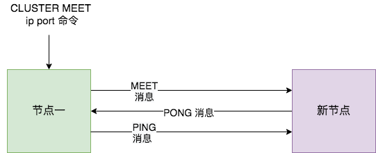
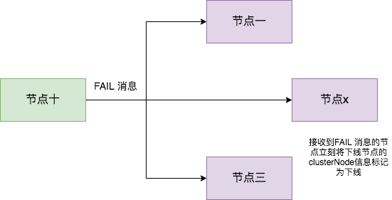

# 集群

在集群中，集群需要维护一定的**元数据**，如实例 IP 地址，缓存分片的 slots 信息，所以需要一套分布式机制来维护元数据的一致性。这类及只有两个模式：分散式和集中式。

## 分散式

分散式机制就是将元数据存储在部分或者所有节点上，不同节点之间不断进行通信来**维护元数据的变更和一致性**。Redis Cluster 就是使用该机制。

分散式的元数据模式有多种可选的算法进行元数据的同步，比如说 Paxos、Raft 和 Gossip。Paxos 和 Raft 等都需要全部节点或者大多数节点(超过一半)正常运行，整个集群才能稳定运行，而 Gossip 则不需要半数以上的节点运行。

## 集中式

集中式是将元数据计中存储在外部节点或者中间件上，比如 zookeeper

## 比较

| 模式   | 优点                                                         | 缺点                                                         |
| ------ | ------------------------------------------------------------ | ------------------------------------------------------------ |
| 集中式 | 数据更新及时，时效好，元数据的更新和读取，时效性非常好，一旦元数据出现了变更，立即就更新到集中式的外部节点中，其他节点读取的时候立即就可以感知到; | 较大数据更新压力，更新压力全部集中在外部节点，作为单点影响整个系统 |
| 分散式 | 数据更新压力分散，元数据的更新比较分散，不是集中某一个节点，更新请求比较分散，而且有不同节点处理，有一定的延时，降低了并发压力 | 数据更新延迟，可能导致集群的感知有一定的滞后                 |

# Gossip 协议

Gossip 协议，利用一种随机、带有传染性的方式，将信息传播到整个网络中，并在一定时间内，使得系统内的所有节点数据一致性。

## 好处

即使集群内节点数量增加，没有节点的负载也不会增加很多，几乎是恒定的，这就允许 redis cluster 节点规模能够横向扩展到数千个。

## 通信机制

Redis Cluster 中的每个节点都维护一份自己视角下的当前整个集群的状态，包括：

1. 当前集群状态
2. 集群中个节点的 slots 信息，以及 migrate 状态
3. 集群中个节点的 master-slave 状态
4. 集群中个结点的存货状态以及怀疑 Fail 状态

Redis Cluster 节点间发送多种消息，如下：

1. meet

   通过 cluster meet ip port 命令，已有节点会向新的节点发送邀请，加入现有集群，然后新节点就会开始与其他节点进行通信

2. ping

   节点按照配置的时间间隔向集群中其它节点发送 ping 消息，消息中带有自己的状态，还有自己维护的集群元数据，和部分其他节点的元数据。

3. pong

   节点用于回应 meet 和 ping 的消息，结构和 ping 消息类似，也包含自己的状态和其他信息，也可以用于信息广播和更新。

4. fail

   节点 ping 不通某节点后，会向集群所有节点广播该节点挂掉的消息。其他节点收到后标记下线。

## ping/pong消息

Redis Cluster 中的节点都会定时地向其他节点发送 PING 消息，来交换各个节点状态信息，检查各个节点状态，包括在线状态、疑似下线状态 PFAIL 和已下线状态 FAIL。

- 一是，每个实例之间会按照一定的频率，从集群中随机挑选一些实例，把 PING 消息发送给挑选出来的实例，用来检测这些实例是否在线，并交换彼此的状态信息。PING 消息中封装了发送消息的实例自身的状态信息、部分其它实例的状态信息，以及 Slot 映射表。
- 二是，一个实例在接收到 PING 消息后，会给发送 PING 消息的实例，发送一个 PONG 消息。PONG 消息包含的内容和 PING 消息一样。

## 新节点上线

Redis Cluster 加入新节点时，客户端需要执行 CLUSTER MEET 命令。

- 节点一在执行 meet 命令后首先会为新节点创建一个 clusterNode 数据，添加到自己的 clusterState 的 nodes 字典中。
- 节点一根据 cluster meet 命令中的 ip 地址和端口号，向新节点发送一条 meet 消息，新节点收到后，也会为节点一创建一个 classNode 数据，并添加到clusterState 的 nodes 字典中。
- 新节点向节点一返回一条 pong 消息。节点一收到 pong 消息后，得知新节点已经接收到了自己发送的 meet 消息。
- 节点一还会向新节点发送一条 ping 消息。新节点接收到这条 ping 消息后，可以知道节点 A 已经成功的接收到了自己返回的 pong 消息，从而完成了新节点接入的握手操作。

meet 操作成功后，节点一会通过 ping 机制将新节点的信息发送给集群中的其他节点，让其他节点与新节点握手。

## 疑似下线与真正下线

cluster 中的节点会定期检查发送 ping 消息的接收方是否在规定时间内(cluster-node-timeout) 内返回 pong 消息，如果没有则会将其标记为疑似下线状态，也就是 **Fail** 状态。

节点一会将借点儿疑似下线的状态发送给其他节点，其它节点得节点二进入 fail 状态后，找到自己维护的节点二的 clusterNode 结构，将主节点一的下线报告添加到 clusterNode 结构的 fail_reports 链表中。

随着时间的推移，如果节点十也因为 pong 超时而认为节点二疑似下线了，并发现自己维护的节点二的 clusterNode 的 fail_reports 中有**半数以上的主节点数量的未过时的将节点二标记为 pFail状态报告日志**，那么节点十就会将节点二标记为**已下线 Fail 状态**。

并且节点十会**立刻**向集群其他节点广播主节点二已经下线的 FAIL 消息，所有收到 FAIL 消息的节点都会立即将节点二状态标记为已下线。如下图所示：

**需要注意的是，报告疑似下线记录是由时效性的，如果超过 cluster-node-timeout *2 的时间，这个报告就会被忽略掉，让节点二又恢复成正常状态。**

https://segmentfault.com/a/1190000038373546