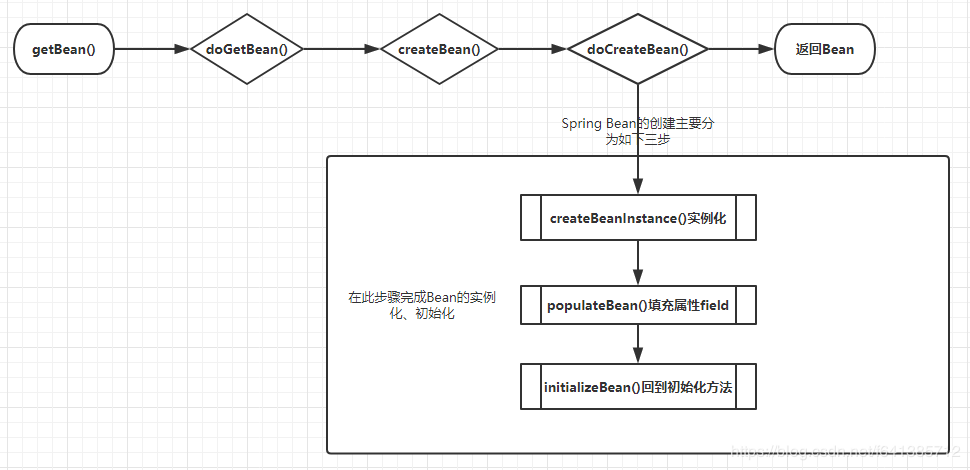

# 依赖注入

## 内容

依赖注入和控制反转含义相同，他们是从两个角度描述同一个概念。 当某个对象实例需要另外一个对象实例时，传统的方法是由调用者创建被调用者的实例，比如使用new，而使用Spring框架后，被调用者的实例不再有调用者创建，而是交给了Spring容器，者称为控制反转。 Spring容器在创建被调用实例时，会自动将调用者需要的对象实例注入为调用者，这样，通过  Spring容器获得被调用者实例，成为依赖注入。

## 实现方式

- 属性 setter 注入

  ```java
  class A {}
  class B {
    private A a;
    public void setA(A a) {
      this.a = a;
    }
  }
  ```

  ```xml
  <!-- 配置Beans.xml-->
  <bean id="a" class="com.ssm.ioc.A" />
  <bean id="b" class="com.ssm.ioc.B" >
  	<property name="a" ref="a"/>
  </bean>
  ```

- 构造器注入

  ```xml
  <bean id="a" class="com.ssm.ioc.A"/>
  <bean id="b" class="com.ssm.ioc.B">
      <constructor-arg name="a" ref="a"/>
  </bean>
  ```

- 静态工厂方式实例化

  ```java
  //创建工厂类
  public class MyBeanFactory {
      public static A createCoffer() {
          return new A();
      }
  }
  ```

  ```xml
  <bean id="a" class="com.ssm.ioc.MyBeanFactory" factory-method="createA"/>
  ```

- 实力工厂实例化

  ```java
  //创建工厂类
  public class MyBeanFactory {
      public MyBeanFactory() {
          System.out.println("A工厂实例化中。。。");
      }
      public A createBean() {
          return new A();
      }
  }
  ```

  ```xml
  <bean id="myBeanFactory" class="com.ssm.ioc.MyBeanFactory"/>
  <bean id="a" factory-bean="myBeanFactory" factory-method="createBean"/>
  ```

- 测试

  ```java
  // 测试
  @Test
  public void test() {
    B b = (B) context.getBean("b");
  }
  ```

# Bean

## 作用域

- singleton: 唯一 bean 实例，即单例
- prototype: 每次请求都会创建一个新的 bean 实例
- request: 每次 http 请求都会产生新的 bean，仅在当前 http request 有效
- session: 没一次来自新session的 http 请求都会产生一个新的bean，该ben仅在该http session内有效
- global-session: 全局 session 作用域，仅仅在基于 portlet 的 web 应用中才有意义，spring5已经没有了。

## 创建

对于 Spring Bean 的创建本质是对象的创建，包含两个过程：对象实例化和对象属性的实例化。其中对象实例化是通过反射实现的，而对象的属性是在对象实例化之后通过一定方法设置的。




 对Bean的创建最为核心三个方法解释如下：

- `createBeanInstance`：实例化，其实也就是调用对象的**构造方法**实例化对象
- `populateBean`：填充属性，这一步主要是对bean的依赖属性进行注入(`@Autowired`)
- `initializeBean`：回到一些形如`initMethod`、`InitializingBean`等方法

**从对`单例Bean`的初始化可以看出，循环依赖主要发生在第二步（populateBean），也就是field属性注入的处理。**

# 循环依赖

- 构造器注入循环依赖

  ```java
  @Service
  public class A {
      private B b；
      public A(B b) {    
          this.b = b;
      }
  }
  
  @Service
  public class B {
      private A a;
      public B(A a) {
          this.a = a;
      }
  }
  ```

  构造器注入构成的循环依赖，此种循环依赖方式**是无法解决的** ，只能抛出`BeanCurrentlyInCreationException`异常表示循环依赖。

  **`根本原因`：** Spring解决循环依赖依靠的是Bean的“中间态”这个概念，而这个中间态指的是 **`已经实例化`** ，但还没初始化的状态。而构造器是完成实例化的东东，所以构造器的循环依赖无法解决~~~

- **singleton**模式field属性注入循环依赖

  ```java
  @Service
  public class A {
      @Autowired
      private B b;
  }
  
  @Service
  public class B {
      @Autowired
      private A a;
  }
  ```

- **prototype**模式field属性注入循环依赖

  ```java
  @Scope(ConfigurableBeanFactory.SCOPE_PROTOTYPE)
  @Service
  public class A {
      @Autowired
      private B b;
  }
  
  @Scope(ConfigurableBeanFactory.SCOPE_PROTOTYPE)
  @Service
  public class B {
      @Autowired
      private A a;
  }
  ```

  **需要注意的是** 本例中**启动时是不会报错的** （因为非单例Bean**`默认`** 不会初始化，而是使用时才会初始化），所以很简单咱们只需要手动**`getBean()`** 或者在一个单例Bean内**`@Autowired`** 一下它即可

# 循环依赖原理

**`Spring的循环依赖的理论依据基于Java的引用传递`** ，当获得对象的引用时，**对象的属性是可以延后设置的** 。（但是构造器必须是在获取引用之前，毕竟你的引用是靠构造器给你生成的）

## 三级缓存

```java
public class DefaultSingletonBeanRegistry extends SimpleAliasRegistry implements SingletonBeanRegistry {
	private final Map<String, Object> singletonObjects = new ConcurrentHashMap<>(256);
  private final Map<String, Object> earlySingletonObjects = new HashMap<>(16);
  private final Map<String, ObjectFactory<?>> singletonFactories = new HashMap<>(16);
  private final Set<String> singletonsCurrentlyInCreation = Collections.newSetFromMap(new ConcurrentHashMap<>(16));
  
}
```

1. `singletonObjects`：用于存放完全初始化好的 bean，**从该缓存中取出的 bean 可以直接使用**
2. `earlySingletonObjects`：提前曝光的单例对象的cache，存放原始的 bean 对象（**尚未填充属性**），用于解决循环依赖
3. `singletonFactories`：单例对象工厂的cache，存放 bean 工厂对象，用于解决循环依赖。**做一些预备工作**。创建bean的时候先存到三级缓存，并不知道后面逻辑会不会用，会不会出现循环依赖等，防止出现循环依赖且AOP等场景

## 解决循环依赖

如果A和B存在循环依赖

1. 实例化A，此时A还未完成属性填充和初始化方法执行，只是一个半成品
2. 为A创建一个Bean工厂，并放到**singletonFactories**中
3. 发现A需要注入B对象，但是一级、二级、三级缓存中都没有发现对象B
4. 实例化B，此时B还未完成属性填充和初始化方法执行，只是一个半成品
5. 为B创建一个Bean工厂，并放到**singletonFactores**中
6. 发现B需要注入A对象，在一二级缓存中没有发现A对象，在三级缓存中发现A对象，于是将三级缓存中的A对象存入二级缓存，并删除三级缓存的A对象。（需要注意的是当前A还是半成品）
7. 将对象A注入到B对象中
8. 对象B完成属性填充，执行初始化方法后，放入一级缓存中，同时删除二级缓存的B对象。（此时B对象是一个成品）
9. 将对象B注入到对象A中。（对象A得到一个完整的B对象）
10. 对象A完成属性填充，执行初始化方法后，放入一级缓存并删除二级缓存中的A对象。

## 创建 Bean 源码

创建 Bean 的方法是在 **AbstractAutowireCapableBeanFactory::doCreateBean()**

```java
// AbstractAutowireCapableBeanFactory::doCreateBean()
protected Object doCreateBean(final String beanName, final RootBeanDefinition mbd, Object[] args) throws BeanCreationException {
    BeanWrapper instanceWrapper = null;
	
    if (instanceWrapper == null) {
        // ① 调用 createBeanInstacnce() 实例化对象
        instanceWrapper = this.createBeanInstance(beanName, mbd, args);
    }

    final Object bean = instanceWrapper != null ? instanceWrapper.getWrappedInstance() : null;
    Class<?> beanType = instanceWrapper != null ? instanceWrapper.getWrappedClass() : null;
   
    // ② 通过 allowCircularReferences 判断是否允许提前暴露对象，如果允许，则通过 addSingletonFactory() 方法添加一个 ObjectFactory 到三级缓存
	boolean earlySingletonExposure = (mbd.isSingleton() && this.allowCircularReferences &&
				isSingletonCurrentlyInCreation(beanName));
    if (earlySingletonExposure) {
        // 添加三级缓存的方法详情在下方
        addSingletonFactory(beanName, () -> getEarlyBeanReference(beanName, mbd, bean));
    }

    // ③ 调用 populateBean() 填充属性
    this.populateBean(beanName, mbd, instanceWrapper);
    // ④ 调用 initialzeBean() 执行初始化方法，并创建代理
    exposedObject = initializeBean(beanName, exposedObject, mbd);
   
    return exposedObject;
}
```

```java
// 添加进三级缓存的方法 addSingletonFactory()
protected void addSingletonFactory(String beanName, ObjectFactory<?> singletonFactory) {
    Assert.notNull(singletonFactory, "Singleton factory must not be null");
    synchronized (this.singletonObjects) {
        if (!this.singletonObjects.containsKey(beanName)) { // 判断一级缓存中不存在此对象
            this.singletonFactories.put(beanName, singletonFactory); // 添加至三级缓存
            this.earlySingletonObjects.remove(beanName); // 删除二级缓存
            this.registeredSingletons.add(beanName);
        }
    }
}

@FunctionalInterface
public interface ObjectFactory<T> {
	T getObject() throws BeansException;
}
```

## ObjectFactory

**为何Spring提前暴露的不是实例化的 Bean，而是将 Bean 包装起来的 ObjectFactory**

涉及到 AOP，如果创建的 Bean 是有代理的，那么注入的就应该是代理 Bean，而不是原始的 Bean。

但是 Spring 一开始并不知道 Bean 是否会有循环依赖，通常情况下（没有循环依赖的情况下），Spring 都会在完成填充属性，并且执行完初始化方法之后再为其创建代理。但是，如果出现了循环依赖的话，Spring 就不得不为其提前创建代理对象，否则注入的就是一个原始对象，而不是代理对象。

Spring 的做法就是在 ObjectFactory 中去提前创建代理对象。它会执行 `getObject()` 方法来获取到 Bean，实际执行的是 **getEarlyBeanReference**。

```java
protected Object getEarlyBeanReference(String beanName, RootBeanDefinition mbd, Object bean) {
    Object exposedObject = bean;
    if (!mbd.isSynthetic() && hasInstantiationAwareBeanPostProcessors()) {
        for (BeanPostProcessor bp : getBeanPostProcessors()) {
            if (bp instanceof SmartInstantiationAwareBeanPostProcessor) {
                SmartInstantiationAwareBeanPostProcessor ibp = (SmartInstantiationAwareBeanPostProcessor) bp;
                // 调用 getEarlyBeanReference 如果需要代理，这里会返回代理对象；否则返回原始对象
                exposedObject = ibp.getEarlyBeanReference(exposedObject, beanName);
            }
        }
    }
    return exposedObject;
}
```

因为提前进行了代理，避免对后面重复创建代理对象，会在 `earlyProxyReferences` 中记录已被代理的对象。

```java
public abstract class AbstractAutoProxyCreator extends ProxyProcessorSupport
		implements SmartInstantiationAwareBeanPostProcessor, BeanFactoryAware {
    @Override
    public Object getEarlyBeanReference(Object bean, String beanName) {
        Object cacheKey = getCacheKey(bean.getClass(), beanName);
        // 记录已被代理的对象
        this.earlyProxyReferences.put(cacheKey, bean);
        return wrapIfNecessary(bean, beanName, cacheKey);
    }
}
```

## 获取依赖源码

通过一个 `getSingleton()` 方法去获取所需要的 Bean 的。

```java
protected Object getSingleton(String beanName, boolean allowEarlyReference) {
    // 一级缓存
    Object singletonObject = this.singletonObjects.get(beanName);
    if (singletonObject == null && isSingletonCurrentlyInCreation(beanName)) {
        synchronized (this.singletonObjects) {
            // 二级缓存
            singletonObject = this.earlySingletonObjects.get(beanName);
            if (singletonObject == null && allowEarlyReference) {
                // 三级缓存
                ObjectFactory<?> singletonFactory = this.singletonFactories.get(beanName);
                if (singletonFactory != null) {
                    // Bean 工厂中获取 Bean
                    singletonObject = singletonFactory.getObject();
                    // 放入到二级缓存中	
                    this.earlySingletonObjects.put(beanName, singletonObject);
                    this.singletonFactories.remove(beanName);
                }
            }
        }
    }
    return singletonObject;
}
```

当 Spring 为某个 Bean 填充属性的时候，它首先会寻找需要注入对象的名称，然后依次执行 `getSingleton()` 方法得到所需注入的对象，而获取对象的过程就是先从一级缓存中获取，一级缓存中没有就从二级缓存中获取，二级缓存中没有就从三级缓存中获取，如果三级缓存中也没有，那么就会去执行 `doCreateBean()` 方法创建这个 Bean。

## 为何不使用二级缓存

如果 Spring 选择二级缓存来解决循环依赖的话，那么就意味着所有 Bean 都需要在实例化完成之后就立马为其创建代理，而 Spring 的设计原则是在 Bean 初始化完成之后才为其创建代理。所以，Spring 选择了三级缓存。但是因为循环依赖的出现，导致了 Spring 不得不提前去创建代理，因为如果不提前创建代理对象，那么注入的就是原始对象，这样就会产生错误。

