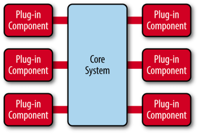

# Apache Dubbo

Dubbo 是一款高性能、轻量级的 Java RPC 框架。

## 核心功能

1. 面向接口代理的高性能 RPC 调用
2. 只能容错和负载均衡
3. 服务自动注册和发现
4. 高度可扩展
5. 运行期流量调度
6. 可视化服务治理与运维

# Dubbo 架构

## 核心角色

- Provider

  服务提供方

- Consumer

  服务消费端

- Registry

  服务注册与发现的**注册中心**。注册中心会返回服务提供者地址列表给消费者。

  > Zookeeper 是 Dubble 的注册中心，当提供者出现断电等异常时，Zookeeper 注册中心能够自动删除提供者信息，当提供者重启时，能够自动注册恢复数据

- Monitor

  统计服务的调用次数和调用时间的**监控中心**

- Container

  服务运行容器

## 过程

Dubbo 架构就是一个 发布-订阅 过程。

- 启动容器 container，加载，**运行服务提供者 Provider**
- 服务提供者 Provider 在启动时，在注册中心**发布注册**自己提供的服务
- 服务消费者 Consumer 在启动时，在注册中心**订阅**自己所需的服务
- 注册中心 Register 返回提供者 Provider 地址列表给消费者，如果有变更，注册中心 Register 基于**长连接**将变更数据给消费者 Consumer
- 消费者 Consumer 从提供者地址列表中，基于**软负载均衡算法**，选一台提供者 Provider 进行调用，如果调用失败，则选另一台调用
- 提供者 Provider 和消费者 Consumenr 在内存中累计调用的次数和时间，定时**每分钟发送一次统计数据到监控中心 Monitor**。

## Invoker

**`Invoker` 就是 Dubbo 对远程调用的抽象。** Invoker 可以分为：

- 服务提供 `Invoker`
- 服务消费 `Invoker`

当调用远程方法时，需要使用动态代理屏蔽远程调用的细节，就可以调用 `Invoker` 来屏蔽底层细节，实现真正的远程调用。

# 工作原理

- **config 配置层**，Dubbo相关的配置。支持代码配置，同时也支持基于 Spring 来做配置，以 `ServiceConfig`, `ReferenceConfig` 为中心
- **proxy 服务代理层**，调用远程方法像调用本地的方法一样简单的一个关键，真实调用过程依赖代理类，以 `ServiceProxy` 为中心。
- **registry 注册中心层**，封装服务地址的注册与发现。
- **cluster 路由层**，封装多个提供者的路由及负载均衡，并桥接注册中心，以 `Invoker` 为中心。
- **monitor 监控层**，RPC 调用次数和调用时间监控，以 `Statistics` 为中心。
- **protocol 远程调用层**，封装 RPC 调用，以 `Invocation`, `Result` 为中心。
- **exchange 信息交换层**：封装请求响应模式，同步转异步，以 `Request`, `Response` 为中心。
- **transport 网络传输层**：抽象 mina 和 netty 为统一接口，以 `Message` 为中心。
- **serialize 数据序列化层** ：对需要在网络传输的数据进行序列化。

# Dubbo SPI

SPI 可以帮助我们动态寻找服务/功能（比如负载均衡策略）的实现。

**SPI 具体原理：**我们将接口的实现类放在配置文件中，我们在程序运行过程中读取配置文件，通过反射加载实现类。这样，我们可以在运行的时候，动态替换接口的实现类。

# Dubbo 微内核

Dubbo 采用 微内核（Microkernel） + 插件（Plugin） 模式，即微内核架构。微内核只负责组装插件。

> 微内核架构模式（有时被称为插件架构模式）是实现基于产品应用程序的一种自然模式。基于产品的应用程序是已经打包好并且拥有不同版本，可作为第三方插件下载的。然后，很多公司也在开发、发布自己内部商业应用像有版本号、说明及可加载插件式的应用软件（这也是这种模式的特征）。微内核系统可让用户添加额外的应用如插件，到核心应用，继而提供了可扩展性和功能分离的用法。

微内核架构包含两类组件：**核心系统（core system）** 和 **插件模块（plug-in modules）**。

核心系统提供系统所需核心能力，插件模块可以扩展系统的功能。因此， 基于微内核架构的系统，非常易于扩展功能。

比如如果觉得Dubbo 的序列化模块实现的不满足自己要求，可以单独实现一个序列化模块。

# 负载均衡策略

负载均衡即在分布式的情况下，避免单个服务响应同意请求，造成服务器宕机、崩溃等问题。

Dubbo 中所有的负载均衡策略都继承自 `AbstractLoadBalance`，该类实现了 `LoadBalance` 接口。

- **RandomLoadBalance**

  根据**权重随机选择**，是 Dubbo 的一种默认负载均衡策略。	

  > 如两台相同的服务器 S1, S2，S1 的权重是 7，S2 的权重是 3。
  >
  > 则生成区间 [0, 10]，落在 [0, 7) 就选择 S1，落在 [7, 10) 就选择 3。

- **LeastActiveLoadBalance**

  即**最小活跃数负载均衡**。

  > 活跃数：初始状态下所有服务提供者的活跃数都为 0，每收到一个请求，对应服务的活跃数就加一，当这个请求处理完之后，活跃数就减一。

  Dubbo 就认为谁的活跃数越少，谁的处理速度就越快，性能也越好，这样的话，我就优先把请求给活跃数少的服务提供者处理。

- **ConsistentHashLoadBalance**

  即**一致性 hash 负载均衡策略**。

  Hash 环中有 2^31 个节点，计算每个服务提供者的 hash 值，放置到 hash 环中。当获取请求时，得到请求的 hash 值，在 hash 环中顺时针查找遇到的第一个服务提供者节点，交由它处理该请求。

  

  同时为了**避免数据倾斜问题**，即节点不够分散，大量请求落到统一节点的问题，引入**虚拟节点**，让节点更加分散，有效均衡各个节点的请求量。

- **RoundRobinLoadBalance**

  即**加权轮询负载均衡**。

  轮询就是将请求一次分配给每个服务提供者，加权轮询就是在轮询的基础上，让更多的请求落到权重更大的服务提供者上。

  > 若有两台服务提供者服务器 S1, S2，S1 的权重为 7，S2 的权重为 3。若有 10 次请求，则 7 次会由 S1 处理，3 次会由 S2 处理。
  >
  > 但是如果是 RandomLoadBalance ，则很可能 9 次都会是 S1 处理（概率性问题）。

# Dubbo 序列化协议

Dubbo 支持多种序列化方式：JDK自带的序列化、hessian2、JSON、Kryo、FST、Protostuff，ProtoBuf等等。

Dubbo 默认使用的序列化方式是 hession2。

## 对这些序列化协议的了解

一般我们不会直接使用 JDK 自带的序列化方式。主要原因有两个：

1. **不支持跨语言调用** : 如果调用的是其他语言开发的服务的时候就不支持了。
2. **性能差** ：相比于其他序列化框架性能更低，主要原因是序列化之后的字节数组体积较大，导致传输成本加大。

JSON 序列化由于性能问题，我们一般也不会考虑使用。

像 Protostuff，ProtoBuf、hessian2这些都是跨语言的序列化方式，如果有跨语言需求的话可以考虑使用。

Kryo和FST这两种序列化方式是 Dubbo 后来才引入的，性能非常好。不过，这两者都是专门针对 Java 语言的。

