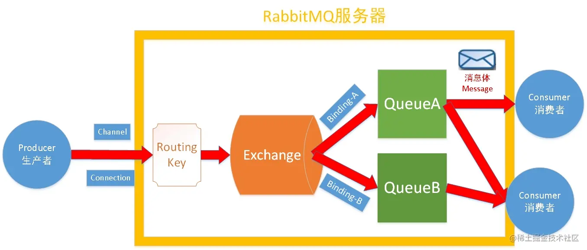

# 基础概念

RabbitMQ是实现了高级消息队列协议（AMQP）的开源消息代理软件（亦称面向消息的中间件）。

## 特点

- RabbitMQ本身安装部署（单实例/集群）均较为简单，**上手门槛低，功能丰富**，符合AMQP标准
- RabbitMQ的集群**易于扩缩**，可以根据实际的业务访问量，通过增减集群中节点实例的方式，达到弹性扩容、缩小的效果
- 企业级消息队列中间件，经过业界各个公司生产环境大量实践案例的验证，**具有较高的可靠性**
- RabbitMQ 提供了一个**易用的用户界面**，使得用户可以监控和管理消息 Broker 的许多方面，如果消息异常，RabbitMQ 提供了**消息跟踪机制**，使用者可以找出发生了什么。
- **支持消息持久化、支持消息确认机制、灵活的任务分发机制**等，支持功能非常丰富
- 实现**高可用性**，可以在RabbitMQ集群中的机器上创建**队列的镜像**，使得在部分节点出问题的情况下队列仍然可用。

## 组成

- Message 消息

  消息是 MQ 的基础，它由消息头和消息体组成。消息体是生产者传递给消费者的信息，而消息头则由一系列的可选属性组成，这些属性包括routing-key（路由键）、priority（相对于其他消息的优先权）、delivery-mode（指出该消息可能需要持久性存储）等。

- Publisher

  消息的生产者，也是一个向交换器发布消息的客户端应用程序。

- Exchange

  交换器，用来接收生产者发送的消息并将这些消息路由给服务器中的队列。

- Routing Key

  路由键是供交换机查看并根据键来决定如何分发消息到列队的一个键，**路由键可以说是消息的目的地址**

- Binding

  绑定，用于消息队列和交换器之间的关联。一个绑定就是**基于路由键将交换器和消息队列连接起来的路由规则**，所以可以将交换器理解成一个由绑定构成的路由表。

- Queue

  消息队列，用来保存消息直到发送给消费者。它是消息的容器，也是消息的终点。一个消息可投入一个或多个队列。消息一直在队列里面，等待消费者连接到这个队列将其取走。

- Connection

  连接RabbitMQ和应用服务器的TCP连接

- Channel

  信道，多路复用连接中的一条独立的双向数据流通道。信道是建立在真实的TCP连接内地虚拟连接，AMQP 命令都是通过信道发出去的，不管是发布消息、订阅队列还是接收消息，这些动作都是通过信道完成。因为对于操作系统来说建立和销毁 TCP 都是非常昂贵的开销，所以引入了信道的概念，以复用一条 TCP 连接。

- Virtual Host

  虚拟主机，**表示一批交换器、消息队列和相关对象**。虚拟主机是共享相同的身份认证和加密环境的独立服务器域。每个 vhost 本质上就是一个 mini 版的 RabbitMQ 服务器，拥有自己的队列、交换器、绑定和权限机制。vhost 是 AMQP 概念的基础，必须在连接时指定。

# 通信过程



## 生产者发送消息

1. Producer先连接到Broker,建立连接Connection,开启一个信道(Channel)。
2. Producer先后声明一个交换器和队列并设置好相关属性，并通过路由键将两者绑定起来。
3. Producer发送消息到Broker,其中包含路由键、交换器等信息。
4. 相应的交换器根据接收到的路由键查找匹配的队列，如果找到，将消息存入对应队列，如果没有找到，会根据生产者的配置丢弃或者退回给生产者
5. 关闭信道与管理连接

## 消费者接收消息

1. Consumer先连接到Broker,建立连接Connection,开启一个信道(Channel)。
2. 向Broker请求消费响应的队列中消息，可能会设置响应的回调函数。
3. Broker回应后接收消息，发送确认收到消息的 ack
4. rabbitmq从队列中删除已经确定的消息
5. 关闭信道与连接

# 消息路由模式||交换器类型

## 直接模式

消息中的路由键（routing key）如果和 Binding 中的 binding key 一致， 交换器就将消息发到对应的队列中。直接模式是一对一的、单播的模式。

这种模式下**不需要将Exchange进行任何绑定(binding)操作**，**消息传递时需要一个“RoutingKey”**，可以简单的理解为要发送到的队列名字。但是**如果vhost中不存在RoutingKey中指定的队列名，则该消息会被抛弃** 。

## 广播模式Fanout

Fanout交换器不处理路由键，只是简单的将队列绑定到交换器上，每个发送到交换器的消息都会被转发到与该交换器绑定的所有队列上。所以Fanout 类型转发消息是最快的。

广播模式模式**不需要RoutingKey，只需要提前将Exchange与Queue进行绑定**，一个Exchange可以绑定多个Queue，一个Queue可以同多个Exchange进行绑定。但是**如果接受到消息的Exchange没有与任何Queue绑定，则消息会被抛弃。**

但是因为转发到全部绑定的队列上，所以广播模式存在**重复消费**的问题。

## 主题模式 Topic

任何发送到Topic Exchange的消息都会被转发到**所有关心RouteKey中指定话题的Queue上**。

每个队列都有其关心的主题，所有的消息都带有一个“标题”(RoutingKey路由键)，Exchange会将消息转发到所有关注主题能与RoutingKey模糊匹配的队列。**主题模式需要RoutingKey，也需要提前绑定Exchange与Queue，在进行绑定时，要提供一个该队列关心的主题**。Topic模式有两个关键词#和*。

- “#”表示0个或若干个关键字，如“#.nanju.#”表示该队列关心所有涉及nanju的消息(一个RoutingKey为”asd.MQ.nanju.error”的消息会被转发到该队列)，

- `*`表示一个关键字息，如“`*`.nanju.`*`”(一个RoutingKey为”asd.nanju.error”的消息会被转发到该队列，而”asd.MQ.nanju.error”则不会)

果Exchange没有发现能够与RoutingKey匹配的Queue，则会抛弃此消息。

# 工作模式

## 简单模式

一个生产者，一个消费者。

- 生产者将消息放入消息队列
- 消息的消费者监听消息队列,如果队列中有消息,就消费掉。消息被消费之后,自动从队列中删除(容易出现消息还没有被消费者正确处理,已经从队列中消失了,造成消息的丢失)

适合场景：

- 简单的聊天系统

## work 模式

一个生产者，多个消费者

- 生产者将消息放入消息队列
- 多个消息的消费者同时监听消息队列内容,谁先拿到谁负责消费消息(高并发情况下,默认会产生某一个消息被多个消费者共同使用,可以设置一个开关，保证一条消息只能被一个消费者使用)

适合场景：

- 抢红包
- 随即分派任务

## 订阅模式

一个生产者发送的消息会被多个消费者获取

- 消息产生者将消息放入交换机
- 交换机发布订阅把消息发送到所有消息队列中,对应消息队列的消费者拿到消息进行消费

适合场景：

- 邮件下发
- 场景订阅
- 短信下发

## 路由模式

不仅发送消息到交换机并且要指定路由key ，而且消费者将队列绑定到交换机时需要指定路由key

- 消息生产者将消息发送给交换机
- 交换机根据Routing key,只能匹配上Routing key对应的消息队列,对应的消费者才能消费消息;

路由模式和订阅模式比较相似，只是路由模式模式要求队列在绑定交换机时要指定Routing key，消息会转发到符合Routing key的队列。

适合场景：

- 邮件下发
- 场景订阅
- 短信下发

## 主题模式

将路由键和某模式进行匹配，此时队列需要绑定在一个模式上，“#”匹配一个词或多个词，“*”只匹配一个词

- 消息产生者产生消息,把消息交给交换机
- 交换机根据key的规则模糊匹配到对应的队列,由队列的监听消费者接收消息消费，每个消费者监听自己的队列，并且设置带统配符的routingkey

适合场景

- 用户通知的各种情况

# 实战用法

## 保证消息投递成功

涉及到了资金和记账问题，如果消息没有投递成功，一定会出现差错

一般的解决方式有这样几种：

- 确认应答机制
- 消息自动补偿机制
- 消息落库，确认消息实际状态
- 消息的延迟投递，做二次检查，回调检查

### 确认应答机制

确认应答机制是rabbitmq自带的，可以设置为手动应答（自动应答很坑），当消费者收到消息在合适的时候来显示的进行确认。消费者说我已经接收到了该消息了，RabbitMQ可以从队列中删除该消息了，可以通过显示告诉消息服务器来删除消息。

```java
channel.basicAck(envelope.getDeliveryTag(), false)
```

### 消息自动补偿机制

在Rabbit MQ里，如果消费者在处理消息时，业务逻辑出现异常，默认会执行补偿机制（也就是消息重试机制）。如果业务逻辑出现异常，是不会消费消息的。

### 消息落库机制

消息落库机制，就是将写入数据库进行持久化，同时不断对消息状态进行确认，以保证消息的消费成功。**可以通过在数据库中确认消息的消费状态，同时有一个机器去定时获取数据库消息的消费状态，如果状态异常的话就进行消息重发**。同时，也可以将重试次数过多的消息状态改为失败消息并登记下来，交给人工处理。

### 消息的延迟投递机制

跟普通的队列不一样的是，普通队列中的元素总是等着希望被早点取出处理，而延时队列中的元素则是**希望被在指定时间得到取出和处理**，所以延时队列中的元素是都是带时间属性的，通常来说是需要被处理的消息或者任务。

在RabbitMQ中要用到**延时队**列，可以通过**死信队列**来实现。当消息设置**TTL（存活时间）\**之后，如果在存活时间内没有被消费，则会成为\**死信**。成为**死信**的消息会被投递到**死信队列**里，消费者只需要监听对应的死信队列进行处理即可。

## 保证消息消费成功

RabbitMQ默认自动确认(ack)消息被正确消费, 即消息投递到消费者后就自动确认消息被处理完毕, 并且会将该消息删除, 即使消费者意外宕机, 或者抛出异常, 如果消费者接收到消息, 还没处理完成就down掉或者抛出异常, 那么, 这条消息就丢失了。

消息确认模式

- AcknowledgeMode.NONE：自动确认
- AcknowledgeMode.AUTO：根据情况确认
- AcknowledgeMode.MANUAL：手动确认

默认情况下消息消费者是自动ack(确认)消息的, 如果要手动ack(确认), 则需要修改确认模式。同时，手动确认可以被批处理，用以一次性处理大量的内容

## 消息持久化

消息被投递到RabbitMQ的内存中, 还没投递到消费者实例之前宕机了, 消息不就丢失了?

可以进行消息持久化, 将Exchange、queue和message都持久化到硬盘, 这样, RabbitMQ重启时, 会把持久化的Exchange、queue和message从硬盘重新加载出来, 重新投递消息。

同时还是需要将消息持久化到数据库中。

## 消费端限流

如果RabbitMQ服务器有上万条未处理的消息，我们随便打开一个消费者客户端，会出现巨量的消息瞬间全部推送过来，但我们单个客户端无法同时处理这么多数据，服务器资源耗尽等情况。

RabbitMQ提供一种qos功能，即在非自动确认消息的前提下，如果一定数目的消息未被确认前，不进行消费新的消息。

## 顺序消息

发送顺序消息，必须保障消息投递到同一个队列，且这个消费者只能有一个（独占模式），同时需要统一提交（可能是合并成一个大消息，也可能是拆分为多个消息），并且所有消息的会话ID一致 添加消息属性：顺序标记的序号、和本次顺序消息的SIZE属性，进行落库操作。每次只消费一条信息，处理过后进行手工ACK，然后接收下一条消息。

## 重复消费

重复消费是消息队列中一个非常危险的问题，特别是在多消费者的模式下，如果一条消息被重复消费，又是涉及资金等方面的话，往往容易出现资金风险。所以，解决消息重复消费的问题是必要的。

**保证消息不被重复消费的关键是保证消息队列的幂等性**

解决方案：

1. 唯一主键 你拿到这个消息做数据库的insert操作。那就容易了，给这个消息做一个唯一主键，那么就算出现重复消费的情况，就会导致主键冲突。
2. redis幂等 你拿到这个消息做redis的set的操作，那就容易了，不用解决，因为你无论set几次结果都是一样的，set操作本来就算幂等操作。 
3. 消费介质 准备一个第三方介质,来做消费记录。以redis为例，给消息分配一个全局id，只要消费过该消息，将<id,message>以K-V形式写入redis。那消费者开始消费前，先去redis中查询有没消费记录即可。

# 集群

## 普通集群

以两个节点（rabbit01、rabbit02）为例来进行说明。rabbit01和rabbit02两个节点仅有相同的元数据，即队列的结构，但消息实体只存在于其中一个节点rabbit01（或者rabbit02）中。

**当消息进入rabbit01节点的Queue后，consumer从rabbit02节点消费时，RabbitMQ会临时在rabbit01、rabbit02间进行消息传输，把A中的消息实体取出并经过B发送给consumer**。所以consumer应尽量连接每一个节点，从中取消息。即对于同一个逻辑队列，要在多个节点建立物理Queue。否则无论consumer连rabbit01或rabbit02，出口总在rabbit01，会产生瓶颈。

当rabbit01节点故障后，rabbit02节点无法取到rabbit01节点中还未消费的消息实体。如果做了消息持久化，那么得等rabbit01节点恢复，然后才可被消费。如果没有持久化的话，就会产生消息丢失的现象。

## 镜像集群

在普通集群的基础上，把需要的队列做成镜像队列，**消息实体会主动在镜像节点间同步，而不是在客户端取数据时临时拉取，也就是说多少节点消息就会备份多少份**。

该模式带来的副作用也很明显，除了降低系统性能外，如果镜像队列数量过多，加之大量的消息进入，集群内部的网络带宽将会被这种同步通讯大大消耗掉。所以在对可靠性要求较高的场合中适用。

**由于镜像队列之间消息自动同步，且内部有选举master机制，即使master节点宕机也不会影响整个集群的使用，达到去中心化的目的，从而有效的防止消息丢失及服务不可用等问题**

相比于普通模式，镜像模式的每个节点的存储空间会非常大，集群的消息积压能力会非常弱（无法通过集群节点的扩容提高消息积压能力）。同时，消息的发布者需要将消息复制到每一个集群节点，对于持久化消息，网络和磁盘同步复制的开销都会明显增加。

# 缺点

系统架构引入消息中间件后的缺点

**系统可用性降低**: 引入MQ，系统多了一个依赖。依赖如果出现问题，就会导致系统可用性降低。一旦引入中间件，就必须考虑这个中间件是如何部署的，如何保证高可用性

**系统稳定性降低**: 引入MQ, 可能由于网络故障、中间件故障、消费者异常等原因导致各种各样乱七八糟的问题产生, 从而使系统稳定性下降

**分布式一致性问题**: 多系统协同处理一个业务, 不能保证所有系统都正常处理, 有可能出现系统数据不一致的情况, 所以此时又需要使用可靠消息最终一致性的分布式事务方案来保障数据一致性
